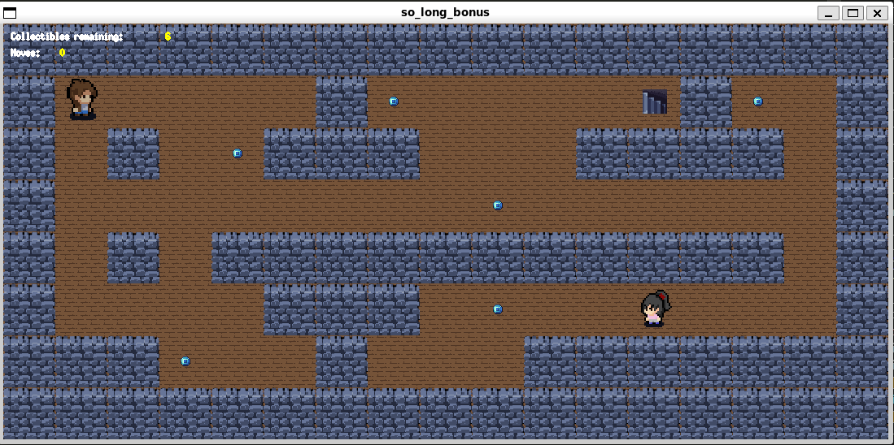

# 🎮 so_long


## 📖 Overview

**so_long** is a charming 2D game created with MinilibX as part of the 42 School curriculum. Navigate through carefully designed maps, collect items, and make your way to the exit while avoiding enemies!

<p align="center">
  
  
</p>

## 🚀 Features

- **Smooth tile-based movement** system
- **Dynamic enemy AI** that reacts to player actions
- **Special abilities** that can be used to pacify enemies
- **Beautiful pixel art graphics**
- **Multiple game endings** based on your choices
- **Robust error handling** for map validation

## 🎯 How to Play

### Controls
- **WASD** or **Arrow Keys**: Move your character
- **R**: Use flower ability (can pacify nearby enemies)
- **ESC**: Exit the game

### Game Elements
- **P**: Player starting position
- **1**: Walls (you cannot move through these)
- **0**: Empty spaces (you can move here)
- **C**: Collectibles (gather all of these to unlock the exit)
- **E**: Exit (your destination after collecting all items)
- **X**: Enemy (will cause game over if touched while angry)

## 🛠️ Installation

### Requirements
- MinilibX library
- GCC compiler
- make

### Building the Game
```bash
git clone https://github.com/yourusername/so_long.git
cd so_long
make bonus
```

### Running the Game
For the base game :
```bash
./so_long maps/map1.ber
```
For the game with bonus :
```bash
./so_long_bonus maps_bonus/map1.ber
```

Bonus add : 
 - Different player textures based on direction
 - No or one ennemy (bonus works if not ennemy is added, add 'X' in .ber file to add it)
 - Interaction with ennemy
 - Moves counter and collectible left displayed directly on the window
 - Few animation

## 🗺️ Map Format

Maps are defined in `.ber` files with the following specifications:
- Must be rectangular
- Must be enclosed by walls ('1')
- Must have exactly one player starting position ('P')
- Must have at least one collectible ('C')
- Must have exactly one exit ('E')
- Must have a valid path from the player to all collectibles and to the exit

Example:
```
1111111111111
1P010000000C1
1000011111001
1P0011E000001
1111111111111
```

## 📚 Technical Details

This project demonstrates proficiency in:
- **Graphics programming** with MinilibX
- **Memory management** to prevent leaks
- **Event handling** for user input
- **Game state management** 
- **Algorithmic problem solving** (pathfinding, collision detection)
- **Clean code organization** following the 42 norm

## 🎓 The 42 Project

This project is part of the 42 School curriculum, designed to teach:
- Graphics library usage
- Game logic implementation
- Clean code practices
- Error handling
- Memory management

## 👤 Author

- Romain Boland ([@RomainBoland](https://github.com/RomainBoland))